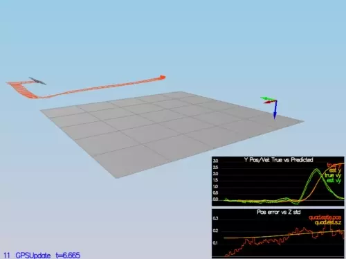
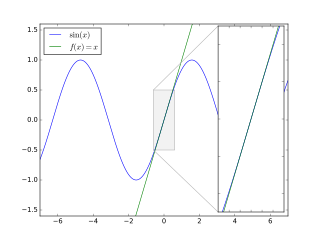
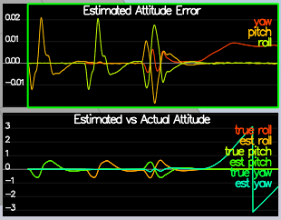
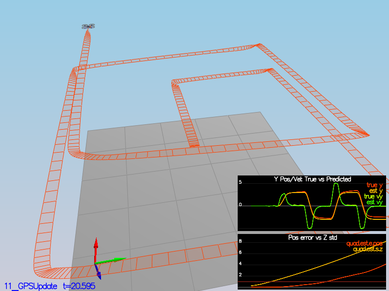
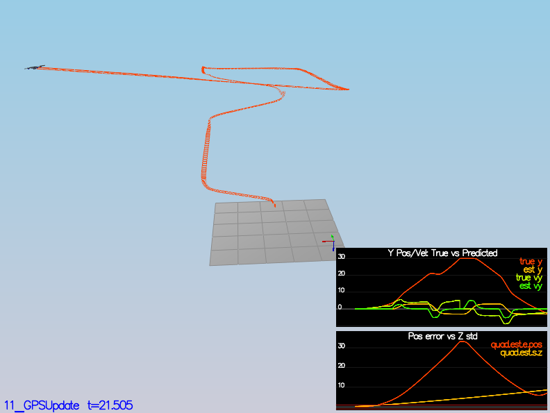
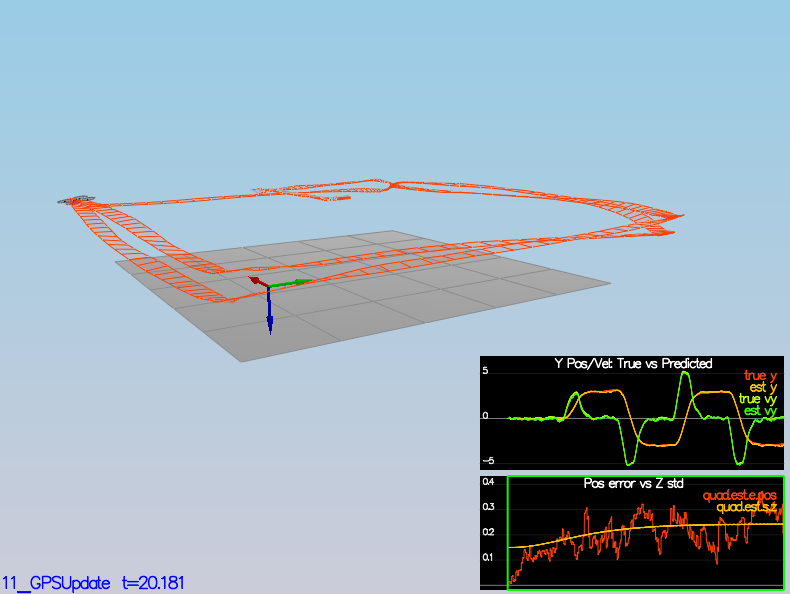
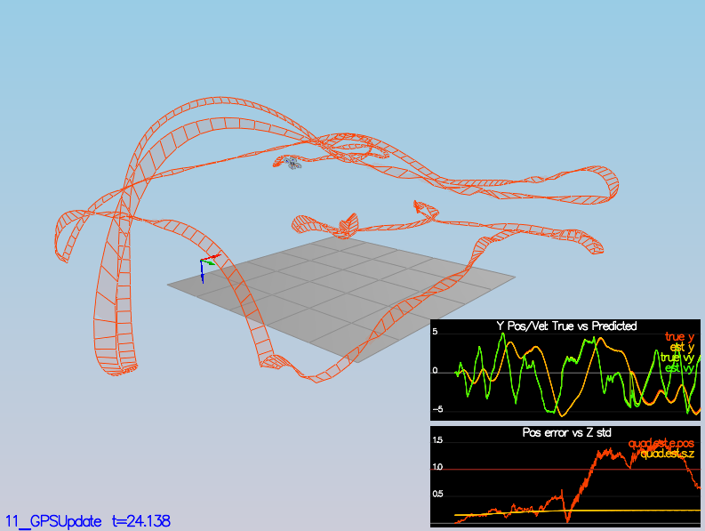
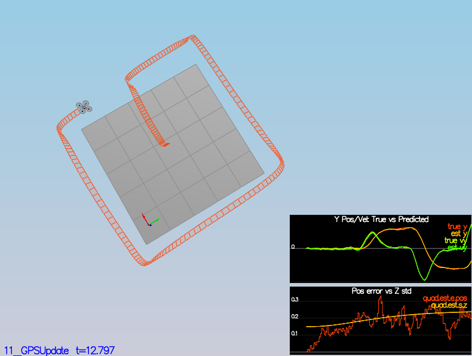

# Quadrotor Sensor Fusion and Pose Estimation

In this continuation of the [controls project](https://github.com/sunsided/FCND-Controls-CPP), 
the sensor fusion and pose estimation code for a your simulated quad drone
will be implemented. 

💡 **Fun fact:** Did you know that the word 🚁 "helicopter" isn't composed of the parts `heli` and `copter`, but of the parts `helico` and `pter`, from greek _helix_ (spiral) and _pteron_ (winged; think [Pterodactylus](https://en.wikipedia.org/wiki/Pterodactylus))? So the pronounciation really should be helico-pter, and a "quadrocopter" actually is a "quadropter". Thanks for listening, now go have fun. 😁



## Project Structure

Here are a couple of interesting points for working with the repo:

 - An Extended Kalman Filter is implemented in `QuadEstimatorEKF.cpp`
 - Parameters for tuning the EKF are in the parameter file `QuadEstimatorEKF.txt`
 - When various sensors are turned on (the scenarios configure them, e.g. 
   `Quad.Sensors += SimIMU, SimMag, SimGPS`), additional sensor plots will become available to see what
   the simulated sensors measure.
 - The EKF implementation exposes both the estimated state and a number of additional variables.
   In particular:
   - `Quad.Est.E.X` is the error in estimated X position from true value.  More generally, the variables in `<vehicle>.Est.E.*` are relative errors, though some are combined errors (e.g. MaxEuler).
   - `Quad.Est.S.X` is the estimated standard deviation of the X state (that is, the square root of the appropriate diagonal variable in the covariance matrix). More generally, the variables in `<vehicle>.Est.S.*` are standard deviations calculated from the estimator state covariance matrix.
   - `Quad.Est.D` contains miscellaneous additional debug variables useful in diagnosing the filter. You may or might not find these useful but they were helpful to us in verifying the filter and may give you some ideas if you hit a block.

### `config` Directory

In the `config` directory, in addition to finding the configuration files for your controller and your
estimator, you will also see configuration files for each of the simulations.  For this project, you
will be working with simulations 06 through 11 and you may find it insightful to take a look at the
configuration for the simulation.

As an example, if we look through the configuration file for scenario 07, we see the following parameters
controlling the sensor:

```
# Sensors
Quad.Sensors = SimIMU
# use a perfect IMU
SimIMU.AccelStd = 0,0,0
SimIMU.GyroStd = 0,0,0
```

This configuration tells us that the simulator is only using an IMU and the sensor data will have no noise.
You will notice that for each simulator these parameters will change slightly as additional sensors are
being used and the noise behavior of the sensors change.

## The Steps

For a description of the original project tasks, see [TASKS.md](TASKS.md).

### Evaluating Sensor Noise

For the [controls project](https://github.com/sunsided/FCND-Controls-CPP), the simulator was working
with a set of entirely noise-free sensors. In order to add realism to the problem, noise is now added
back in. To do so, some noisy sensor data is collected in simulator scenario `06_NoisySensors`
and then evaluated.

In this scenario, a drone is kept motionless while sensor data is collected.
When run, two CSV files are created:

- [`config/log/Graph1.txt`](config/log/Graph1.txt) contains GPS X position measurements, and
- [`config/log/Graph2.txt`](config/log/Graph2.txt) contains accelerometer data for the X direction.

The Python script [`scripts/determine-sensor-noise.py`](scripts/determine-sensor-noise.py) was written
to evaluate the data. When executed like so,

```bash
scripts/determine-sensor-noise.py config/log/Graph1.txt
```

it gives something along the lines of

```
Found field names:
- Quad.GPS.X

Statistics:
- Series:     Quad.GPS.X
  Count:      23
  Min:        -1.571771
  Max:        0.976935
  Mean:       -0.06606665217391307
  Std. Error: 0.1379983888851819
  Std. Dev:   0.661817023581923
```

Note that `time` data has been removed from the output for brevity. A Conda environment is available
in [`environment.yaml`](environment.yaml) and can be set up using

```bash
conda env create -f environment.yaml
conda activate udacity-fcnd
```

The obtained standard deviations are

- **GPS X/Y:** `0.7077498542201446`
- **Accelerometer X/Y:** `0.4891275427009619`

The [`config/06_SensorNoise.txt`](config/06_SensorNoise.txt) configuration file was updated with
the obtained standard deviations, after which the simulator correctly detects that approximately 68% of
all sensor data fall into the µ ± σ range. 
See [`config/SimulatedSensors.txt`](config/SimulatedSensors.txt) for sensor parameters shipped with
the starter code.


### Attitude Estimation by Complementary Filter

In theory, gyro data could be integrated constantly in order to obtain an attitude
estimate. Due to the noise characteristics of a gyro sensor however and the fact
that it gets integrated with every update, this approach performing extremely badly and
results in noticeable drift.

To mitigate, a complementary filter-type solution can be used that combines
attitude from integrated gyro roll rates with direct attitude estimation from the
accelerometer, thus combining fast updates from the gyro with long-term stability
of the accelerometer. 

In order to first perform attitude estimation from the gyro, the starter code used a
simple integration scheme like so: 

```c++
auto predictedPitch = pitchEst + dtIMU * gyro.y;
auto predictedRoll  = rollEst  + dtIMU * gyro.x;
auto predictedYaw   = yawEst   + dtIMU * gyro.z;
```

The main problem with the this approach is that it is only a
[small-angle approximation](https://en.wikipedia.org/wiki/Small-angle_approximation),
and - concretely - valid only with very small roll rates. Specifically is it based 
on the idea that a sinusoidal function is approximately linear in any small
environment around zero and follow directly from a Taylor series
approximation of the `sin` and `cos` functions (at zero).



To fix this, a quaternion-based integration was implemented to apply body frame
roll rates to inertial frame euler angles:

```c++
const auto orientation = Quaternion<float>::FromEuler123_RPY(rollEst, pitchEst, yawEst);
const auto rollRate    = Quaternion<float>::FromAxisAngle(gyro * dtIMU);
const auto predictedOrientation = rollRate * orientation;

const auto predictedPitch = predictedOrientation.Pitch();
const auto predictedRoll  = predictedOrientation.Roll();
const auto predictedYaw   = wrapAngle(predictedOrientation.Yaw()); // -π .. +π
```

Here, `wrapAngle(radians)` is a helper function that ensures a provided angle is in -π .. +π range.

Lastly, the complementary filter fuses the gyro-predicted roll and pitch angle
with the accelerometer-predicted roll and pitch angles in the usual fashion:

```c++
const auto gyroWeight  = attitudeTau / (attitudeTau + dtIMU);
const auto accelWeight = 1 - gyroCoeff; // dtIMU / (attitudeTau + dtIMU);

rollEst  = wrapAngle(gyroWeight * predictedRoll  + accelWeight * accelRoll);
pitchEst = wrapAngle(gyroWeight * predictedPitch + accelWeight * accelPitch);
```

Here's the output after implementing the above:



Note that the pitch and roll errors temporarily reach (only) about ±0.02 rad,
or about ±1.15°, and quickly go back to zero.

The yaw error permanently increases at the and of the cycle since the drone
is performing a rotation around its up axis. However, the yaw angle is not yet
fused with another sensor (note that in the above, yaw is only integrated from
roll rates, which leads to the aforementioned drift). To fix this, extra
information such as the magnetometer's absolute orientation information
will be required.

For comparison, here's an excerpt from the starter code:

> In the screenshot \[below] the attitude estimation using linear scheme (left) and using the improved nonlinear
  scheme (right) \[is shown]. Note that Y axis on error is much greater on left.
>
> 


### EKF Prediction

The state and covariance prediction steps of the Extended Kalman Filter were
implemented using scenario `08_PredictState` and `09_PredictionCov` of the simulator.

Note that scenario `08_PredictState` uses only uses a noise-free IMU and suppresses
the accelerometer by using an extremely high complementary filter weight for the
gyroscope (`QuadEstimatorEKF.attitudeTau = 100`) in order to suppress
drift from the doubly integrated accelerometer.

Not much is to say here; the `PredictState()` method was implemented to fast-forward
the state vector:

```c++
const auto accelInertialFrame = bodyToInertialFrame(accel) - gravity;

predictedState(0) += predictedState(3) * dt;
predictedState(1) += predictedState(4) * dt;
predictedState(2) += predictedState(5) * dt;

predictedState(3) += accelInertialFrame.x * dt;
predictedState(4) += accelInertialFrame.y * dt;
predictedState(5) += accelInertialFrame.z * dt;
```

Here, the accelerometer data was used as control input `u` since it is a somewhat
reasonable approximation of the actual (human-provided) controls.

Then, the `Predict()` method was updated to fast-forward the
covariance matrix and produce a new state and covariance estimate:

```c++
// Build the transition function's Jacobian
gPrime(0,3) = dt;
gPrime(1,4) = dt;
gPrime(2,5) = dt;
gPrime(3,6) = (RbgPrime(0,0) * accel.x + RbgPrime(0,1) * accel.y + RbgPrime(0,2) * accel.z) * dt;
gPrime(4,6) = (RbgPrime(1,0) * accel.x + RbgPrime(1,1) * accel.y + RbgPrime(1,2) * accel.z) * dt;
gPrime(5,6) = (RbgPrime(2,0) * accel.x + RbgPrime(2,1) * accel.y + RbgPrime(2,2) * accel.z) * dt;

// Covariance update
ekfCov = gPrime * ekfCov * gPrime.transpose() + Q;
```

Here, `RbgPrime` is determined by the `GetRbgPrime()` helper method, which in turn constructs
the Jacobian of the body-to-inertial frame rotation matrix (with the "g" in "Rbg" standing
for global):

```c++
// Roll
RbgPrime(0, 0) = -cosTheta * sinPsi;
RbgPrime(0, 1) = -sinPhi   * sinTheta * sinPsi - cosPhi * cosPsi;
RbgPrime(0, 2) = -cosPhi   * sinTheta * sinPsi + sinPhi * cosPsi;

// Pitch
RbgPrime(1, 0) =  cosTheta * cosPsi;
RbgPrime(1, 1) =  sinPhi   * sinTheta * cosPsi - cosPhi * sinPsi;
RbgPrime(1, 2) =  cosPhi   * sinTheta * cosPsi + sinPhi * sinPsi;
```

Lastly, [`config/QuadEstimatorEKF.txt`](config/QuadEstimatorEKF.txt) was updated
to provide X/Y position and velocity standard deviations (`QPosXYStd` and `QVelXYStd`
respectively) in order to capture the error ranges somewhat accurately over
a small time horizon of one second. This process was done entirely empirically
by eyeballing the error plots and resulted in the following values:

| Parameter         | New value     |
| ----------------- | ------------- |
| **`QPosXYStd`**   | `.05`         |
| **`QVelXYStd`**   | `.2`          |

Here's about how it looks: 


Note that while this is a picture from the starter code, it _somewhat_ resembles
the actual output.

### Magnetometer Update

Previously, only gyroscope and accelerometer were used for state estimation. In this step,
the magnetometer is added in order to improve the drone's heading estimation; 
for this, scenario `10_MagUpdate` of the simulator is used.

The `UpdateFromMag()` method obtains a measurement of the magnetometer, as well as the
yaw prediction from the current EKF state, determines the observation function's Jacobian
(with respect to the yaw measurement) and updates the state:

```c++
const auto measuredYaw   = ekfState(6);
measurementPrediction(0) = smallerAngle(measuredYaw, yawFromMagnetometer);
hPrime(0,6)              = 1.0;
```

Here, `smallerAngle(predicted, measurement)` ensures that angles ±180° are inverted
(for example, +359° is equal to -1°).

Lastly, the yaw error standard deviation (`QYawStd` in [`config/QuadEstimatorEKF.txt`](config/QuadEstimatorEKF.txt))
was obtained empirically by ensuring that about 68% of the sensor noise was captured.
The following value was obtained this way:

| Parameter         | New value     |
| ----------------- | ------------- |
| **`QYawStd`**     | `.1175`       |

The result looked somewhat like this (just better):


### Closed Loop and GPS Update

So far, only ideal estimators and IMUs were used. Using scenario `11_GPSUpdate`, disabling the
ideal estimator by setting `Quad.UseIdealEstimator` to `0` in
[`config/11_GPSUpdate.txt`](config/11_GPSUpdate.txt) gives the following beauty of a path:



Going one step further and allowing for a nonzero noise in the IMU by commenting out the
zero-valued standard deviations like so ...

```
#SimIMU.AccelStd = 0,0,0
#SimIMU.GyroStd = 0,0,0
```

... sends the drone off to explore outer space 👋:



The GPS update (`UpdateFromGPS()`) can be implemented in a rather trivial fashion -
the key here is that GPS measures both position and velocity directly, and we already
have estimates for everything in the EKF's state. Likewise, the partial derivatives
are just a diagonal matrix (the last column being all zeroes due to the yaw not playing
a role in position updates):

```c++
for (int i = 0; i < 6; ++i) {
    zFromX(i) = ekfState(i);
}

hPrime.setIdentity();
```

After this, it was back to parameter tuning in [`config/QuadEstimatorEKF.txt`](config/QuadEstimatorEKF.txt).
Here's the current set of values:

| Parameter         | New value     |
| ----------------- | ------------- |
| **`QPosXYStd`**   | `.1`          |
| **`QVelXYStd`**   | `.15`         |
| **`QPosZStd`**    | `.03`         |
| **`QVelZStd`**    | `.025`        |
| **`QYawStd`**     | `.1175`       |
| **`GPSPosXYStd`** | `.7`          |
| **`GPSVelXYStd`** | `1`           |
| **`GPSPosZStd`**  | `2`           |
| **`GPSVelZStd`**  | `.3`          |
| **`MagYawStd`**   | `1`           |
| **`attitudeTau`** | `75`          |
| **`InitStdDevs`** | all above     |

Note that the actual standard deviations for the GPS are known from
[`config/SimulatedSensors.txt`](config/SimulatedSensors.txt). It is also somewhat fishy that the
position standard deviations are so close to the velocity ones, even though they're undergoing
a pass of integrating noise - however, the results seem pretty good, so I'm not going to argue.



### Patching in the Controller

In a final desperate move, the controller from the [control project](https://github.com/sunsided/FCND-Controls-CPP)
was added to replace the relaxed one that was used for implementing the state estimation.

Surely enough, just using the controller parameters that were obtained using ideal data doesn't fly 
(pun _so_ intended):



Here are some soothing words from the Ghost of the README past:

> If your controller crashes immediately do not panic. Flying from an
> estimated state (even with ideal sensors) is very different from flying with ideal pose. You may need
> to de-tune your controller. Decrease the position and velocity gains (we’ve seen about 30% detuning
> being effective) to stabilize it.  Your goal is to once again complete the entire simulation cycle
> with an estimated position error of < 1m.

And ...

> **Hint:** you may find it easiest to do your de-tuning as a 2 step process by reverting to ideal
> sensors and de-tuning under those conditions first.

What came as a shock to me was that detuning the gains by 30% wasn't even remotely helpful, and
reducing gains by up to an order of magnitude was required. Here is the set of gains as they are
used now:

| Gain          | Old value    | New value    |
| ------------- | -------------| ------------ |
| **`kpPosXY`** | `35`         | `5`          |
| **`kpPosZ`**  | `25`         | `20`         |
| **`KiPosZ`**  | `42`         | `15`         |
| **`kpVelXY`** | `12`         | `4`          |
| **`kpVelZ`**  | `15`         | `9`          |
| **`kpBank`**  | `13`         | `10`         |
| **`kpYaw`**   | `3`          | `3`          |
| **`kpPQR`**   | `85, 85, 10` | `90, 90, 10` |

With a too high position P gain (`kpPosXY`), overshooting was noticeable, whereas a too high
position D gain (`kpVelXY`) resulted in very unstable hover. 



## Authors

Thanks to Fotokite for the initial development of the project code and simulator.
